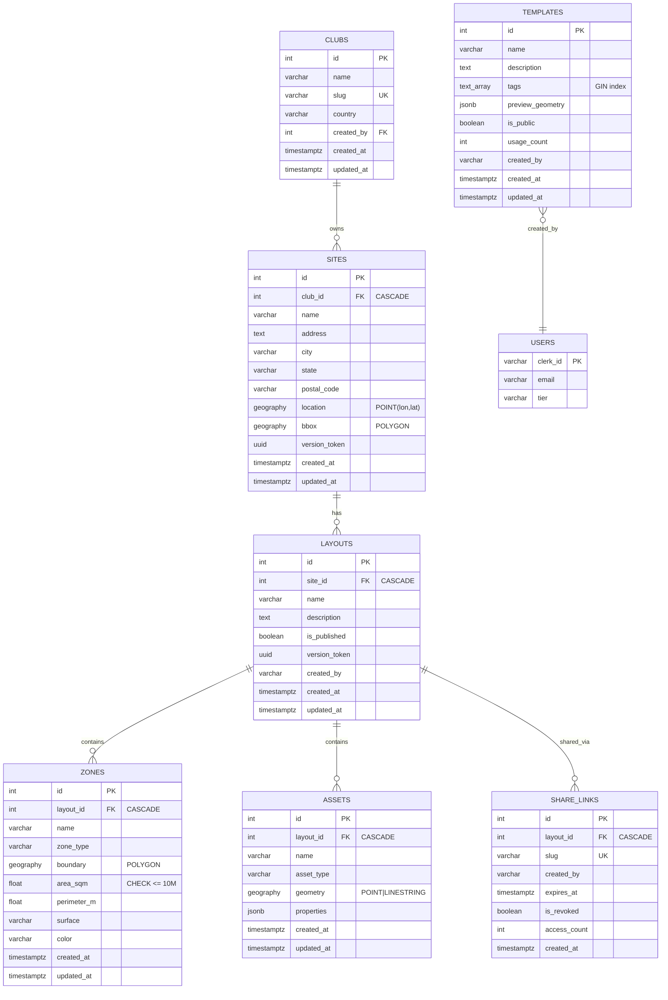

# Database Schema Diagram - Field Layout System

**Version:** 1.0  
**Date:** October 20, 2025  
**Database:** PostgreSQL 16 with PostGIS 3.4  

## Entity Relationship Diagram



## Table Descriptions

### Core Tables

#### **SITES**
Represents physical locations (sports complexes, parks) with geospatial data.

- **Purpose:** Central location entity replacing the old `venues` table
- **PostGIS Columns:**
  - `location`: Single point (SRID 4326) marking the site center
  - `bbox`: Polygon boundary defining site extents
- **Key Features:**
  - Version tokens for optimistic concurrency
  - Cascade delete from clubs
  - GIST spatial index on `location` for proximity searches

#### **LAYOUTS**
Field configurations at a specific site (e.g., "Match Day Setup", "Training Configuration").

- **Purpose:** Store multiple field arrangements per site
- **Key Features:**
  - Published/draft status for visibility control
  - Version tokens for conflict resolution
  - Creator tracking via Clerk user ID
  - Cascade delete from sites

#### **ZONES**
Areas within a layout (pitches, goal areas, training zones) with boundaries.

- **Purpose:** Define field regions with PostGIS polygons
- **PostGIS Columns:**
  - `boundary`: Polygon geography (SRID 4326)
- **Key Features:**
  - Auto-calculated `area_sqm` and `perimeter_m`
  - ST_IsValid constraint (no self-intersecting polygons)
  - Max area constraint (10,000,000 m² = 10 km²)
  - GIST spatial index for boundary queries
  - Cascade delete from layouts

#### **ASSETS**
Point/linear objects in a layout (goals, cones, lines, markers).

- **Purpose:** Store individual field elements with flexible metadata
- **PostGIS Columns:**
  - `geometry`: Point or LineString geography (SRID 4326)
- **Key Features:**
  - Geometry type constraint (POINT or LINESTRING only)
  - JSONB `properties` for flexible attributes (color, dimensions, etc.)
  - GIST spatial index for geometry queries
  - Cascade delete from layouts

### Supporting Tables

#### **TEMPLATES**
Reusable layout configurations for quick setup.

- **Purpose:** Allow users to apply pre-configured layouts
- **Key Features:**
  - TEXT[] `tags` for categorization (e.g., `['soccer', '11v11', 'training']`)
  - GIN index on tags for fast array searches
  - JSONB `preview_geometry` storing snapshot of zones/assets
  - Usage count tracking for popularity sorting
  - Public/private visibility control

#### **SHARE_LINKS**
Shareable URLs for layouts (view-only access).

- **Purpose:** Enable layout sharing via unique URLs
- **Key Features:**
  - Unique 12-character `slug`
  - Optional expiration timestamp
  - Revocation support
  - Access count tracking
  - Partial indexes on active/expiring links
  - Cascade delete from layouts

## Cascade Delete Behavior

```
DELETE FROM clubs WHERE id = 1
  └─> sites (CASCADE)
      └─> layouts (CASCADE)
          ├─> zones (CASCADE)
          ├─> assets (CASCADE)
          └─> share_links (CASCADE)
```

**Example:**
1. Deleting a club removes all its sites
2. Deleting a site removes all its layouts
3. Deleting a layout removes all zones, assets, and share links

## Index Strategy

### Spatial Indexes (GIST)
- `idx_sites_location` - Site proximity searches
- `idx_zones_boundary` - Zone overlap/containment queries
- `idx_assets_geometry` - Asset proximity searches

### Array Indexes (GIN)
- `idx_templates_tags` - Fast tag containment queries (`tags @> ARRAY['soccer']`)

### Partial Indexes (Filtered)
- `idx_layouts_is_published` - Only published layouts (WHERE is_published = TRUE)
- `idx_share_links_is_revoked` - Only active links (WHERE is_revoked = FALSE)
- `idx_share_links_expires_at` - Only expiring links (WHERE expires_at IS NOT NULL)

### Standard B-tree Indexes
- `idx_layouts_site_id` - Foreign key lookups
- `idx_layouts_created_by` - User's layouts
- `idx_layouts_updated_at` - Recent layouts (DESC)
- `idx_zones_layout_id` - Foreign key lookups
- `idx_zones_type` - Filter by zone type
- `idx_assets_layout_id` - Foreign key lookups
- `idx_assets_type` - Filter by asset type
- `idx_templates_created_by` - User's templates
- `idx_templates_is_public` - Public templates only
- `idx_templates_usage_count` - Sort by popularity (DESC)

## PostGIS Data Types

All geospatial columns use `geography` type with SRID 4326 (WGS84):

| Column | Type | Geometry Type | Use Case |
|--------|------|---------------|----------|
| `sites.location` | `geography(POINT, 4326)` | Single point | Site center coordinates |
| `sites.bbox` | `geography(POLYGON, 4326)` | Polygon | Site boundary |
| `zones.boundary` | `geography(POLYGON, 4326)` | Polygon | Zone area (pitch, goal area) |
| `assets.geometry` | `geography(GEOMETRY, 4326)` | Point or LineString | Goals (point), lines (linestring) |

**Why geography over geometry?**
- Accurate distance/area calculations on Earth's surface
- Uses meters for measurements (not degrees)
- Automatically handles dateline wrapping

## Migration Sequence

The schema was created through 7 migrations executed in this order:

1. **0007_create_sites_table.ts** - Sites with PostGIS location/bbox
2. **0007a_rename_old_tables.ts** - Preserve old layouts/templates as _deprecated
3. **0008_create_layouts_table.ts** - Layouts with version tokens
4. **0009_create_zones_table.ts** - Zones with PostGIS boundary + validation
5. **0010_create_assets_table.ts** - Assets with geometry type constraint
6. **0011_create_templates_table.ts** - Templates with TEXT[] tags + JSONB
7. **0012_create_share_links_table.ts** - ShareLinks with unique slug
8. **0013_migrate_venues_to_sites.ts** - Data migration from venues → sites

## Version History

| Version | Date | Changes |
|---------|------|---------|
| 1.0 | Oct 20, 2025 | Initial schema design for field layout system |

---

**Related Documentation:**
- [Migration Guide](./0001-migration-guide.md)
- [PostGIS Functions](./0001-postgis-functions.md)
- [Troubleshooting](./0001-troubleshooting.md)
