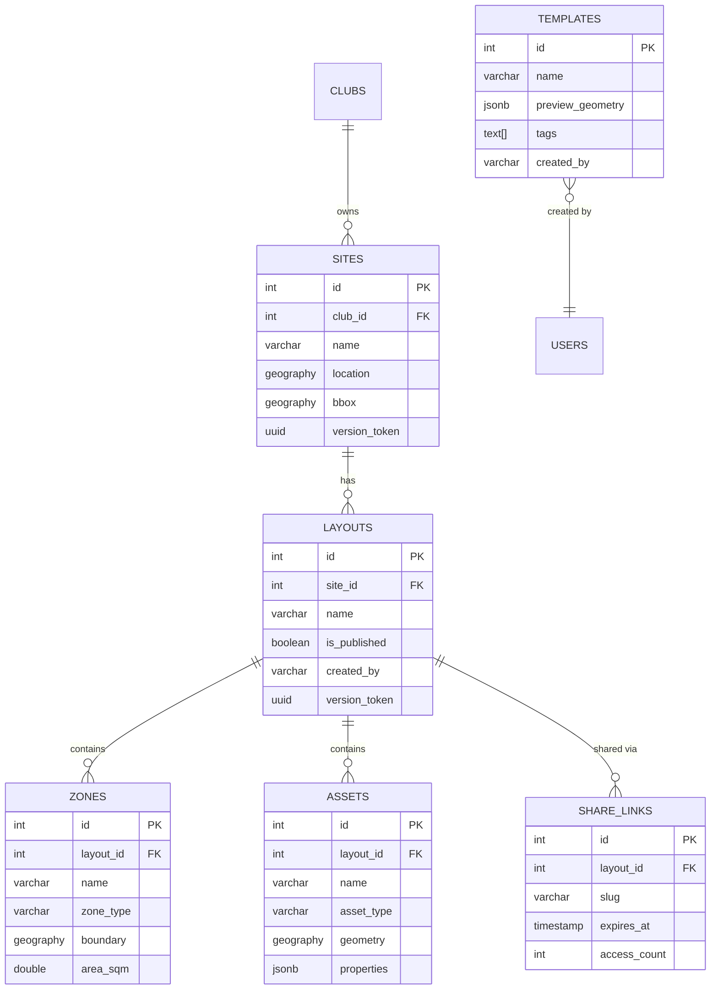

# TASK 1: Database Schema & Migrations - Subtasks

**Parent Task:** TASK 1 - Database Schema & Migrations  
**Document:** Subtask Breakdown  
**Created:** 2025-10-20  
**Status:** 🟢 READY TO START  
**Estimated Duration:** 3-4 days

## Overview

Create 6 new tables (Sites, Layouts, Zones, Assets, Templates, ShareLinks) with PostGIS geography columns, proper indexes, and data migration from Venues → Sites. All migrations must be reversible and tested.

**Prerequisites Met:**
- ✅ PostgreSQL 16 + PostGIS 3.4 running (port 5432)
- ✅ Knex migrations configured (`src/db/knexfile.ts`)
- ✅ Environment variables set (`DATABASE_URL`, `DATABASE_URL_TEST`)
- ✅ Turf.js installed for geospatial calculations
- ✅ Geometry validation utilities in `src/lib/geospatial.ts`

---

## Subtask Execution Order

```
[1.1] → [1.2] → [1.3] → [1.4] → [1.5] → [1.6] → [1.7] → [1.8]
                                          ↓
                                        [1.9] → [1.10]
```

**Critical Path:** Subtasks 1.1-1.6 are sequential (each table references previous ones)  
**Parallel Work:** Subtask 1.9 (seed data) can start after 1.6 completes  
**Final Validation:** Subtasks 1.7, 1.8, 1.10 verify entire schema

---

## Subtask 1.1: Create Sites Table

**Goal:** Add `sites` table with PostGIS location (POINT) and bbox (POLYGON).

**Estimated Time:** 2-3 hours

**Files to Create/Modify:**
```
src/db/migrations/0007_create_sites_table.ts
```

**Schema Definition:**
```typescript
export async function up(knex: Knex): Promise<void> {
  await knex.raw('CREATE EXTENSION IF NOT EXISTS postgis');
  
  await knex.schema.createTable('sites', (table) => {
    table.increments('id').primary();
    table.integer('club_id').notNullable()
      .references('id').inTable('clubs').onDelete('CASCADE');
    table.string('name', 200).notNullable();
    table.text('address');
    table.string('city', 100);
    table.string('state', 50);
    table.string('country', 50).defaultTo('USA');
    table.string('postal_code', 20);
    // PostGIS columns added via raw SQL
    table.uuid('version_token').notNullable().defaultTo(knex.raw('gen_random_uuid()'));
    table.timestamp('created_at', { useTz: true }).notNullable().defaultTo(knex.fn.now());
    table.timestamp('updated_at', { useTz: true }).notNullable().defaultTo(knex.fn.now());
    table.timestamp('deleted_at', { useTz: true });
  });
  
  // Add PostGIS columns (geography type)
  await knex.raw(`
    ALTER TABLE sites 
    ADD COLUMN location geography(POINT, 4326),
    ADD COLUMN bbox geography(POLYGON, 4326)
  `);
  
  // Indexes
  await knex.raw(`
    CREATE INDEX idx_sites_club_id ON sites(club_id) WHERE deleted_at IS NULL;
    CREATE INDEX idx_sites_location ON sites USING GIST(location) WHERE deleted_at IS NULL;
    CREATE INDEX idx_sites_updated_at ON sites(updated_at DESC) WHERE deleted_at IS NULL;
  `);
}

export async function down(knex: Knex): Promise<void> {
  await knex.schema.dropTableIfExists('sites');
}
```

**Validation Commands:**
```bash
# Apply migration
npm run db:migrate

# Verify table structure
docker exec plottr_postgres psql -U postgres -d plottr_dev -c "\d sites"

# Check PostGIS columns
docker exec plottr_postgres psql -U postgres -d plottr_dev -c "
  SELECT column_name, udt_name, data_type 
  FROM information_schema.columns 
  WHERE table_name = 'sites' AND column_name IN ('location', 'bbox')
"

# Test rollback
npm run db:rollback
npm run db:migrate
```

**Acceptance Criteria:**
- ✅ `sites` table exists in both `plottr_dev` and `plottr_test` databases
- ✅ `location` column type is `geography(Point,4326)`
- ✅ `bbox` column type is `geography(Polygon,4326)`
- ✅ 3 indexes created (club_id, location GIST, updated_at)
- ✅ Foreign key to `clubs` table enforces CASCADE delete
- ✅ `npm run db:rollback` removes table cleanly

---

## Subtask 1.2: Create Layouts Table

**Goal:** Add `layouts` table referencing `sites` with version tokens and creator tracking.

**Estimated Time:** 1-2 hours

**Files to Create/Modify:**
```
src/db/migrations/0008_create_layouts_table.ts
```

**Schema Definition:**
```typescript
export async function up(knex: Knex): Promise<void> {
  await knex.schema.createTable('layouts', (table) => {
    table.increments('id').primary();
    table.integer('site_id').notNullable()
      .references('id').inTable('sites').onDelete('CASCADE');
    table.string('name', 200).notNullable();
    table.text('description');
    table.boolean('is_published').notNullable().defaultTo(false);
    table.uuid('version_token').notNullable().defaultTo(knex.raw('gen_random_uuid()'));
    table.string('created_by', 100).notNullable(); // Clerk user ID
    table.timestamp('created_at', { useTz: true }).notNullable().defaultTo(knex.fn.now());
    table.timestamp('updated_at', { useTz: true }).notNullable().defaultTo(knex.fn.now());
  });
  
  // Indexes
  await knex.raw(`
    CREATE INDEX idx_layouts_site_id ON layouts(site_id);
    CREATE INDEX idx_layouts_created_by ON layouts(created_by);
    CREATE INDEX idx_layouts_updated_at ON layouts(updated_at DESC);
    CREATE INDEX idx_layouts_is_published ON layouts(is_published) WHERE is_published = TRUE;
  `);
}

export async function down(knex: Knex): Promise<void> {
  await knex.schema.dropTableIfExists('layouts');
}
```

**Validation Commands:**
```bash
npm run db:migrate
docker exec plottr_postgres psql -U postgres -d plottr_dev -c "\d layouts"
docker exec plottr_postgres psql -U postgres -d plottr_dev -c "
  SELECT constraint_name, constraint_type 
  FROM information_schema.table_constraints 
  WHERE table_name = 'layouts'
"
```

**Acceptance Criteria:**
- ✅ `layouts` table exists with foreign key to `sites`
- ✅ 4 indexes created (site_id, created_by, updated_at, is_published)
- ✅ `version_token` auto-generates UUID on insert
- ✅ Cascade delete from `sites` removes related layouts
- ✅ Rollback succeeds without orphaned foreign key references

---

## Subtask 1.3: Create Zones Table

**Goal:** Add `zones` table with PostGIS boundary (POLYGON) and computed area/perimeter.

**Estimated Time:** 2-3 hours

**Files to Create/Modify:**
```
src/db/migrations/0009_create_zones_table.ts
```

**Schema Definition:**
```typescript
export async function up(knex: Knex): Promise<void> {
  await knex.schema.createTable('zones', (table) => {
    table.increments('id').primary();
    table.integer('layout_id').notNullable()
      .references('id').inTable('layouts').onDelete('CASCADE');
    table.string('name', 100).notNullable();
    table.string('zone_type', 50).notNullable(); // 'pitch', 'goal_area', etc.
    table.string('surface', 50); // 'grass', 'turf', 'clay'
    table.string('color', 7); // Hex color for rendering
    table.double('area_sqm'); // Computed from ST_Area
    table.double('perimeter_m'); // Computed from ST_Perimeter
    table.timestamp('created_at', { useTz: true }).notNullable().defaultTo(knex.fn.now());
    table.timestamp('updated_at', { useTz: true }).notNullable().defaultTo(knex.fn.now());
  });
  
  // Add PostGIS boundary column
  await knex.raw(`
    ALTER TABLE zones 
    ADD COLUMN boundary geography(POLYGON, 4326) NOT NULL
  `);
  
  // Add constraints
  await knex.raw(`
    ALTER TABLE zones
    ADD CONSTRAINT chk_valid_boundary CHECK (ST_IsValid(boundary::geometry)),
    ADD CONSTRAINT chk_max_area CHECK (area_sqm IS NULL OR area_sqm <= 10000000)
  `);
  
  // Indexes
  await knex.raw(`
    CREATE INDEX idx_zones_layout_id ON zones(layout_id);
    CREATE INDEX idx_zones_boundary ON zones USING GIST(boundary);
    CREATE INDEX idx_zones_type ON zones(zone_type);
  `);
}

export async function down(knex: Knex): Promise<void> {
  await knex.schema.dropTableIfExists('zones');
}
```

**Validation Commands:**
```bash
npm run db:migrate

# Verify boundary column
docker exec plottr_postgres psql -U postgres -d plottr_dev -c "
  SELECT column_name, udt_name 
  FROM information_schema.columns 
  WHERE table_name = 'zones' AND column_name = 'boundary'
"

# Test constraint
docker exec plottr_postgres psql -U postgres -d plottr_dev -c "
  INSERT INTO zones (layout_id, name, zone_type, boundary, area_sqm) 
  VALUES (1, 'Test', 'pitch', ST_GeogFromText('POLYGON((0 0, 1 0, 1 1, 0 1, 0 0))'), 15000000)
" || echo "✓ Constraint rejected >10km² polygon"
```

**Acceptance Criteria:**
- ✅ `zones` table exists with `geography(POLYGON, 4326)` boundary
- ✅ `chk_valid_boundary` constraint enforces valid geometry
- ✅ `chk_max_area` constraint rejects polygons >10 km²
- ✅ GIST index on `boundary` for spatial queries
- ✅ Foreign key cascade delete from `layouts` works

---

## Subtask 1.4: Create Assets Table

**Goal:** Add `assets` table with PostGIS geometry (POINT or LINESTRING only).

**Estimated Time:** 2 hours

**Files to Create/Modify:**
```
src/db/migrations/0010_create_assets_table.ts
```

**Schema Definition:**
```typescript
export async function up(knex: Knex): Promise<void> {
  await knex.schema.createTable('assets', (table) => {
    table.increments('id').primary();
    table.integer('layout_id').notNullable()
      .references('id').inTable('layouts').onDelete('CASCADE');
    table.string('name', 100).notNullable();
    table.string('asset_type', 50).notNullable(); // 'goal', 'cone', 'line', 'marker'
    table.jsonb('properties'); // Flexible metadata (color, size, notes)
    table.timestamp('created_at', { useTz: true }).notNullable().defaultTo(knex.fn.now());
    table.timestamp('updated_at', { useTz: true }).notNullable().defaultTo(knex.fn.now());
  });
  
  // Add PostGIS geometry column (POINT or LINESTRING)
  await knex.raw(`
    ALTER TABLE assets 
    ADD COLUMN geometry geography(GEOMETRY, 4326) NOT NULL
  `);
  
  // Constraint: Only POINT or LINESTRING allowed
  await knex.raw(`
    ALTER TABLE assets
    ADD CONSTRAINT chk_geometry_type CHECK (
      ST_GeometryType(geometry::geometry) IN ('ST_Point', 'ST_LineString')
    )
  `);
  
  // Indexes
  await knex.raw(`
    CREATE INDEX idx_assets_layout_id ON assets(layout_id);
    CREATE INDEX idx_assets_geometry ON assets USING GIST(geometry);
    CREATE INDEX idx_assets_type ON assets(asset_type);
  `);
}

export async function down(knex: Knex): Promise<void> {
  await knex.schema.dropTableIfExists('assets');
}
```

**Validation Commands:**
```bash
npm run db:migrate

# Test POINT constraint (should succeed)
docker exec plottr_postgres psql -U postgres -d plottr_dev -c "
  INSERT INTO assets (layout_id, name, asset_type, geometry) 
  VALUES (1, 'Test Point', 'marker', ST_GeogFromText('POINT(0 0)'))
" && echo "✓ POINT accepted"

# Test POLYGON constraint (should fail)
docker exec plottr_postgres psql -U postgres -d plottr_dev -c "
  INSERT INTO assets (layout_id, name, asset_type, geometry) 
  VALUES (1, 'Test Polygon', 'marker', ST_GeogFromText('POLYGON((0 0, 1 0, 1 1, 0 0))'))
" || echo "✓ POLYGON rejected"
```

**Acceptance Criteria:**
- ✅ `assets` table exists with `geography(GEOMETRY, 4326)` column
- ✅ `chk_geometry_type` constraint allows only POINT/LINESTRING
- ✅ GIST index on `geometry` for spatial queries
- ✅ JSONB `properties` column allows flexible metadata
- ✅ Constraint rejects POLYGON/MULTIPOINT geometries

---

## Subtask 1.5: Create Templates Table

**Goal:** Add `templates` table with JSONB preview_geometry and search indexes.

**Estimated Time:** 1 hour

**Files to Create/Modify:**
```
src/db/migrations/0011_create_templates_table.ts
```

**Schema Definition:**
```typescript
export async function up(knex: Knex): Promise<void> {
  await knex.schema.createTable('templates', (table) => {
    table.increments('id').primary();
    table.string('name', 200).notNullable();
    table.text('description');
    table.specificType('tags', 'TEXT[]'); // Array of keywords
    table.jsonb('preview_geometry').notNullable(); // Snapshot of zones/assets
    table.boolean('is_public').notNullable().defaultTo(false);
    table.string('created_by', 100).notNullable(); // Clerk user ID
    table.integer('usage_count').notNullable().defaultTo(0);
    table.timestamp('created_at', { useTz: true }).notNullable().defaultTo(knex.fn.now());
    table.timestamp('updated_at', { useTz: true }).notNullable().defaultTo(knex.fn.now());
  });
  
  // Indexes
  await knex.raw(`
    CREATE INDEX idx_templates_created_by ON templates(created_by);
    CREATE INDEX idx_templates_is_public ON templates(is_public) WHERE is_public = TRUE;
    CREATE INDEX idx_templates_tags ON templates USING GIN(tags);
    CREATE INDEX idx_templates_usage_count ON templates(usage_count DESC);
  `);
}

export async function down(knex: Knex): Promise<void> {
  await knex.schema.dropTableIfExists('templates');
}
```

**Validation Commands:**
```bash
npm run db:migrate
docker exec plottr_postgres psql -U postgres -d plottr_dev -c "\d templates"

# Test array column
docker exec plottr_postgres psql -U postgres -d plottr_dev -c "
  INSERT INTO templates (name, preview_geometry, created_by, tags) 
  VALUES ('Test', '{}'::jsonb, 'user-1', ARRAY['soccer', 'training'])
" && echo "✓ Tags array works"
```

**Acceptance Criteria:**
- ✅ `templates` table exists with TEXT[] tags column
- ✅ GIN index on `tags` for array searches
- ✅ JSONB `preview_geometry` column validated
- ✅ Partial index on `is_public = TRUE` for public template queries
- ✅ Usage count index for popularity sorting

---

## Subtask 1.6: Create ShareLinks Table

**Goal:** Add `share_links` table with unique slug, expiry, and access tracking.

**Estimated Time:** 1 hour

**Files to Create/Modify:**
```
src/db/migrations/0012_create_share_links_table.ts
```

**Schema Definition:**
```typescript
export async function up(knex: Knex): Promise<void> {
  await knex.schema.createTable('share_links', (table) => {
    table.increments('id').primary();
    table.integer('layout_id').notNullable()
      .references('id').inTable('layouts').onDelete('CASCADE');
    table.string('slug', 12).notNullable().unique();
    table.timestamp('expires_at', { useTz: true }); // NULL = no expiry
    table.boolean('is_revoked').notNullable().defaultTo(false);
    table.integer('access_count').notNullable().defaultTo(0);
    table.string('created_by', 100).notNullable(); // Clerk user ID
    table.timestamp('created_at', { useTz: true }).notNullable().defaultTo(knex.fn.now());
    table.timestamp('last_accessed_at', { useTz: true });
  });
  
  // Indexes
  await knex.raw(`
    CREATE INDEX idx_share_links_slug ON share_links(slug) WHERE is_revoked = FALSE;
    CREATE INDEX idx_share_links_layout_id ON share_links(layout_id);
    CREATE INDEX idx_share_links_expires_at ON share_links(expires_at) WHERE expires_at IS NOT NULL;
  `);
}

export async function down(knex: Knex): Promise<void> {
  await knex.schema.dropTableIfExists('share_links');
}
```

**Acceptance Criteria:**
- ✅ `share_links` table exists with UNIQUE constraint on `slug`
- ✅ Partial index on `slug` excludes revoked links
- ✅ Partial index on `expires_at` excludes NULL (permanent links)
- ✅ Foreign key cascade delete from `layouts` works
- ✅ Duplicate slug insertion fails with constraint violation

---

## Subtask 1.7: Data Migration - Venues to Sites

**Goal:** Migrate existing `venues` data to new `sites` table, preserving location/bbox.

**Estimated Time:** 3-4 hours

**Files to Create/Modify:**
```
src/db/migrations/0013_migrate_venues_to_sites.ts
```

**Migration Strategy:**
```typescript
export async function up(knex: Knex): Promise<void> {
  // Copy venues to sites
  await knex.raw(`
    INSERT INTO sites (
      club_id, name, address, city, state, country, postal_code,
      location, bbox, version_token, created_at, updated_at
    )
    SELECT 
      club_id, name, address, city, state, country, postal_code,
      location, bbox, version_token, created_at, updated_at
    FROM venues
    WHERE deleted_at IS NULL
  `);
  
  // Update pitches to reference sites (if pitches.venue_id exists)
  // NOTE: This may not be needed if pitches are being replaced by zones
  
  console.log(`Migrated ${await knex('sites').count('* as count').first()} venues to sites`);
}

export async function down(knex: Knex): Promise<void> {
  // Rollback: Delete migrated sites
  await knex('sites').del();
}
```

**Validation Commands:**
```bash
# Count venues before migration
docker exec plottr_postgres psql -U postgres -d plottr_dev -c "SELECT COUNT(*) FROM venues"

# Run migration
npm run db:migrate

# Verify site count matches
docker exec plottr_postgres psql -U postgres -d plottr_dev -c "SELECT COUNT(*) FROM sites"

# Check location data preserved
docker exec plottr_postgres psql -U postgres -d plottr_dev -c "
  SELECT name, ST_AsText(location::geometry) 
  FROM sites LIMIT 3
"
```

**Acceptance Criteria:**
- ✅ All non-deleted venues copied to sites
- ✅ PostGIS location/bbox columns preserved correctly
- ✅ Club_id foreign keys remain valid
- ✅ No data loss (venue count = site count)
- ✅ Rollback removes migrated data cleanly

---

## Subtask 1.8: Seed Data - Example Sites & Layouts

**Goal:** Create 3 example sites with 5 layouts, 20 zones, 50 assets for testing.

**Estimated Time:** 2-3 hours

**Files to Create/Modify:**
```
src/db/seeds/0002_example_sites_layouts.ts
```

**Seed Data Structure:**
```typescript
export async function seed(knex: Knex): Promise<void> {
  // Site 1: Training Complex (NYC)
  const site1 = await knex('sites').insert({
    club_id: 1,
    name: 'Manhattan Training Complex',
    address: '1234 Broadway, New York, NY 10001',
    city: 'New York',
    state: 'NY',
    country: 'USA',
    location: knex.raw(`ST_GeogFromText('POINT(-73.9857 40.7580)')`),
    bbox: knex.raw(`ST_GeogFromText('POLYGON((-73.986 40.757, -73.985 40.757, -73.985 40.759, -73.986 40.759, -73.986 40.757))')`),
  }).returning('id');
  
  // Layout 1: Full Field Setup
  const layout1 = await knex('layouts').insert({
    site_id: site1[0].id,
    name: 'Full Field Training Setup',
    description: 'Standard 11v11 pitch with training zones',
    is_published: true,
    created_by: 'seed-user-1',
  }).returning('id');
  
  // Zone 1: Main Pitch
  await knex('zones').insert({
    layout_id: layout1[0].id,
    name: 'Main Pitch',
    zone_type: 'pitch',
    surface: 'grass',
    color: '#22c55e',
    boundary: knex.raw(`ST_GeogFromText('POLYGON((-73.9858 40.7575, -73.9852 40.7575, -73.9852 40.7585, -73.9858 40.7585, -73.9858 40.7575))')`),
    area_sqm: 7140, // ~105m x 68m
    perimeter_m: 346,
  });
  
  // Asset 1: Center Goal
  await knex('assets').insert({
    layout_id: layout1[0].id,
    name: 'North Goal',
    asset_type: 'goal',
    geometry: knex.raw(`ST_GeogFromText('POINT(-73.9855 40.7585)')`),
    properties: { width_m: 7.32, height_m: 2.44, color: '#ffffff' },
  });
  
  // ... repeat for 2 more sites, 4 more layouts, 19 more zones, 49 more assets
}
```

**Validation Commands:**
```bash
npm run db:seed

# Verify counts
docker exec plottr_postgres psql -U postgres -d plottr_dev -c "
  SELECT 
    (SELECT COUNT(*) FROM sites) as sites,
    (SELECT COUNT(*) FROM layouts) as layouts,
    (SELECT COUNT(*) FROM zones) as zones,
    (SELECT COUNT(*) FROM assets) as assets
"

# Check spatial data
docker exec plottr_postgres psql -U postgres -d plottr_dev -c "
  SELECT name, ST_AsText(location::geometry) FROM sites LIMIT 3
"
```

**Acceptance Criteria:**
- ✅ 3 sites created in different cities (NYC, LA, Chicago)
- ✅ 5 layouts distributed across sites (2, 2, 1)
- ✅ 20 zones with valid boundaries (no overlaps within same layout)
- ✅ 50 assets (goals, cones, lines) linked to layouts
- ✅ All geometries valid (ST_IsValid returns TRUE)
- ✅ Seed script is idempotent (can run multiple times)

---

## Subtask 1.9: Integration Tests - Schema Validation

**Goal:** Write tests to validate all tables, constraints, indexes, and migrations.

**Estimated Time:** 3-4 hours

**Files to Create/Modify:**
```
tests/integration/schema.validation.test.ts
```

**Test Coverage:**
```typescript
describe('Database Schema Validation', () => {
  describe('Sites Table', () => {
    it('should have location column with geography(POINT, 4326) type', async () => {
      const result = await knex.raw(`
        SELECT udt_name FROM information_schema.columns 
        WHERE table_name = 'sites' AND column_name = 'location'
      `);
      expect(result.rows[0].udt_name).toBe('geography');
    });
    
    it('should enforce foreign key to clubs table', async () => {
      await expect(
        knex('sites').insert({ club_id: 99999, name: 'Invalid' })
      ).rejects.toThrow(/foreign key constraint/);
    });
    
    it('should have GIST index on location column', async () => {
      const indexes = await knex.raw(`
        SELECT indexname FROM pg_indexes WHERE tablename = 'sites'
      `);
      expect(indexes.rows.some(r => r.indexname === 'idx_sites_location')).toBe(true);
    });
  });
  
  describe('Zones Table', () => {
    it('should reject invalid boundary geometry', async () => {
      await expect(
        knex.raw(`
          INSERT INTO zones (layout_id, name, zone_type, boundary)
          VALUES (1, 'Invalid', 'pitch', ST_GeogFromText('POLYGON((0 0, 1 1))'))
        `)
      ).rejects.toThrow(/invalid geometry/);
    });
    
    it('should reject area_sqm > 10km²', async () => {
      await expect(
        knex('zones').insert({
          layout_id: 1,
          name: 'Too Large',
          zone_type: 'pitch',
          boundary: knex.raw(`ST_GeogFromText('POLYGON((0 0, 1 0, 1 1, 0 1, 0 0))')`),
          area_sqm: 15000000,
        })
      ).rejects.toThrow(/chk_max_area/);
    });
  });
  
  describe('Assets Table', () => {
    it('should accept POINT geometry', async () => {
      const asset = await knex('assets').insert({
        layout_id: 1,
        name: 'Test Point',
        asset_type: 'marker',
        geometry: knex.raw(`ST_GeogFromText('POINT(0 0)')`),
      }).returning('id');
      expect(asset[0].id).toBeGreaterThan(0);
    });
    
    it('should reject POLYGON geometry', async () => {
      await expect(
        knex('assets').insert({
          layout_id: 1,
          name: 'Test Polygon',
          asset_type: 'marker',
          geometry: knex.raw(`ST_GeogFromText('POLYGON((0 0, 1 0, 1 1, 0 0))')`),
        })
      ).rejects.toThrow(/chk_geometry_type/);
    });
  });
  
  describe('Migration Rollback', () => {
    it('should rollback all 6 new tables cleanly', async () => {
      await knex.migrate.rollback({ all: true });
      
      const tables = await knex.raw(`
        SELECT tablename FROM pg_tables 
        WHERE schemaname = 'public' AND tablename IN ('sites', 'layouts', 'zones', 'assets', 'templates', 'share_links')
      `);
      expect(tables.rows.length).toBe(0);
      
      await knex.migrate.latest(); // Re-apply for subsequent tests
    });
  });
});
```

**Validation Commands:**
```bash
npm test tests/integration/schema.validation.test.ts -i
```

**Acceptance Criteria:**
- ✅ 30+ test cases covering all 6 tables
- ✅ Tests validate column types, constraints, indexes
- ✅ Foreign key cascade behavior tested
- ✅ PostGIS geometry constraints tested (valid/invalid polygons)
- ✅ Migration rollback tested (all tables removed)
- ✅ All tests pass on clean database

---

## Subtask 1.10: Documentation - Schema Diagram & Migration Guide

**Goal:** Create visual schema diagram and step-by-step migration guide.

**Estimated Time:** 2 hours

**Files to Create/Modify:**
```
tasks/0001-schema-diagram.md
tasks/0001-migration-guide.md
```

**Schema Diagram (Mermaid):**


**Migration Guide Contents:**
1. Prerequisites (PostgreSQL 16, PostGIS 3.4)
2. Backup instructions (`pg_dump` command)
3. Migration execution order (0007 → 0013)
4. Rollback procedures
5. Troubleshooting common errors
6. Performance optimization tips (VACUUM ANALYZE)

**Acceptance Criteria:**
- ✅ Schema diagram shows all 6 tables with relationships
- ✅ Migration guide covers backup/restore procedures
- ✅ Rollback instructions tested on clean database
- ✅ Common error messages documented with solutions
- ✅ PostGIS extension setup documented

---

## Summary & Handoff

**Total Estimated Time:** 18-23 hours (~3-4 days with testing)

**Files Created:**
- 7 migration files (`0007_*.ts` → `0013_*.ts`)
- 1 seed file (`0002_example_sites_layouts.ts`)
- 1 test file (`tests/integration/schema.validation.test.ts`)
- 2 documentation files (schema diagram, migration guide)

**Validation Checklist:**
```bash
# 1. Run all migrations
npm run db:migrate

# 2. Verify table count
docker exec plottr_postgres psql -U postgres -d plottr_dev -c "\dt" | wc -l
# Expected: 15+ tables (6 new + existing)

# 3. Run seed data
npm run db:seed

# 4. Verify row counts
docker exec plottr_postgres psql -U postgres -d plottr_dev -c "
  SELECT 
    (SELECT COUNT(*) FROM sites) as sites,
    (SELECT COUNT(*) FROM layouts) as layouts,
    (SELECT COUNT(*) FROM zones) as zones,
    (SELECT COUNT(*) FROM assets) as assets
"
# Expected: sites=3, layouts=5, zones=20, assets=50

# 5. Run schema validation tests
npm test tests/integration/schema.validation.test.ts -i

# 6. Test rollback
npm run db:rollback
npm run db:migrate

# 7. Run preflight check
npm run preflight
```

**Ready for TASK 2:** Once all 10 subtasks complete, database schema is ready for backend API implementation.

**Handoff Notes:**
- All PostGIS columns use `geography` type (not `geometry`) for WGS84 lat/lon accuracy
- Foreign keys use `ON DELETE CASCADE` to prevent orphaned records
- All tables have `updated_at` triggers (add via `0014_add_updated_at_triggers.ts` if needed)
- Indexes are optimized for common queries (pagination, spatial lookups, searches)
- Seed data provides realistic test cases for frontend development

---

**Next Steps After Completion:**
1. ✅ Mark TASK 1 as COMPLETE in `tasks/0004-parent-tasks.md`
2. 🟢 Proceed to TASK 2 (Backend API - Sites & Layouts CRUD)
3. 📋 Generate TASK 2 subtasks document
